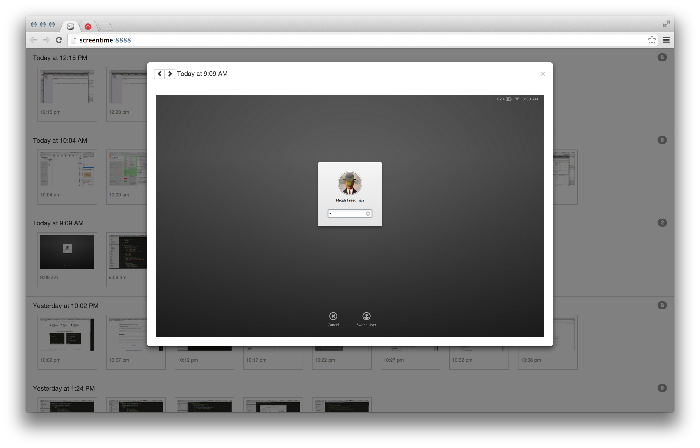

# ScreenTime
"All right, Mr. DeMille, I'm ready for my close-up."

## What is this?

I'm absolutely terrible at tracking my time. I always forget to start the timer. And then I always forget to stop the timer when I switch tasks. However, I think knowing how long I spend on things would be useful. To that end, I'm using the free version of [toggl](https://www.toggl.com) for tracking time, but supplementing it with an automated screencapture system so I can easily review what I was doing on my computer when.

There are several apps available that integrate screenshots with timing software, but I find the creep factor too strong to want to use them. Instead, I wrote a simple shell script to capture screenshots, along with a simple web app for viewing them.

Pull requests & contributions are encouraged.

## How to use it?

There are three components, all of which are in this repository:

 - capture.sh -- a bash script for capturing screenshots on a periodic basis
 - local server -- any simple static server will do
 - capture viewer -- a single-page web app for viewing the captured screenshots

Check out the project, create `screens`, `screens/full` & `screens/thumbs` folders inside the project, and run capture.sh in a shell. I just leave it running pretty much all the time. For the capture viewer, any static server will do. The easiest is probably the python one built-in to OSX, which you can run by entering `python -m SimpleHTTPServer 8000` in a terminal from the `screentime` folder and then going to `http://localhost:8000` in a browser. More suggestions below.

### capture.sh 

shell script for caturing screenshots periodically

 - just a basic sleep loop that runs every five minutes (configurable)
 - takes a screenshot using OSX's `screencapture` program
 - copies it into `screens/full`
 - creates a thumbnail-sized version and copies that to `screens/thumbs`
 - after each capture, updates a static list of all the files that can be served to the web app (`screens/screens-list.txt`)
 - enhancement ideas:
	- start & stop commands
	- set a limit, either # of files, # of bytes, or # of days to keep, cull older items outside of limit
	- collect more data
		- current application
		- current document / site
		- mouse/keyboard activity
	- incorporate some advice from: http://robertmuth.blogspot.com/2012/08/better-bash-scripting-in-15-minutes.html

### local server 

simple static server to support the capture viewer (below)

 - I'm using php, but can be any static server:
 - python -m SimpleHTTPServer
 - php -S localhost:8000 (PHP 5.4.0)
 - http-server for node
 - http://stackoverflow.com/questions/12905426/faster-alternative-to-pythons-simplehttpserver

### capture viewer

single-page web gallery for viewing images

 - pretty basic at the moment
 - enhancement ideas:
 	- UI
 		- ~~sort with most recent group on top~~
		- open/close groups
		- group by day
		- add control panel
			- time range slider / pagination (currently only shows most recent 150 images)
			- open/close all
			- sorting options
			- grouping options(?)
		- zoomed view
			- make max size larger
			- prev/next buttons over whole image
			- keyboard navigation
		- badges are hard to notice & not that useful
 		- ~~auto refresh with latest screenshots~~
	- Technical
		- proper build process w/ linting & tests
		- sass
		- clean up architecture a bit

### time tracking integration

*Not implemented*
 
 - Eventually it might be nice to associate groups of images with a (persistent) description & integrate that with time tracking software
 - There are loads of such tools out there. I'm currently playing with toggl and it seems to be working fairly well. Not sure there's any need for more integration.
 - Some CLI time trackers:
	- https://news.ycombinator.com/item?id=7409926
	- http://brettterpstra.com/projects/doing/
	- http://projecthamster.wordpress.com
	- https://github.com/aziz/PlainTasks
	- https://github.com/christiangenco/t_time_tracker
	- now() { echo $(date "+%Y-%m-%d %H:%M:%S") - "$@" >> $HOME/.now }
 	- https://github.com/larose/utt
 	- http://wtime.sourceforge.net/
 	- https://github.com/projecthamster/hamster

## License

[MIT](license.txt) 